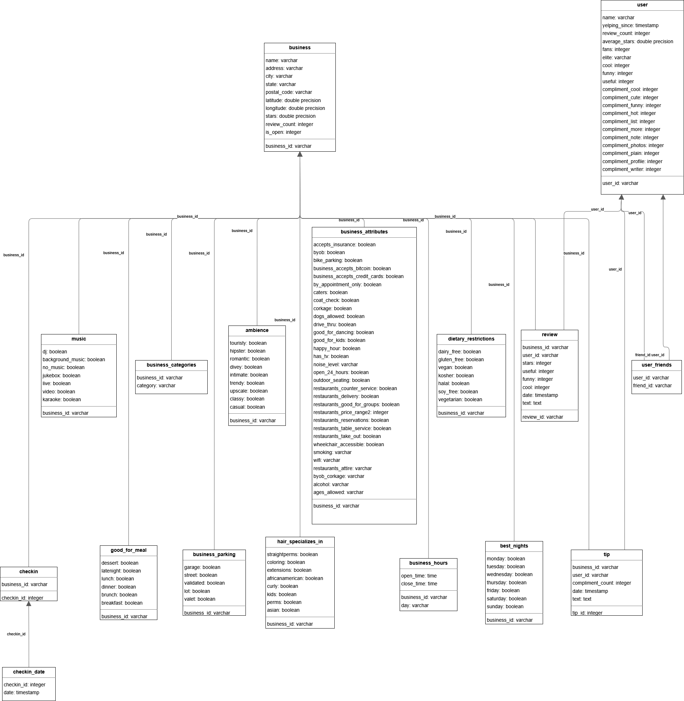
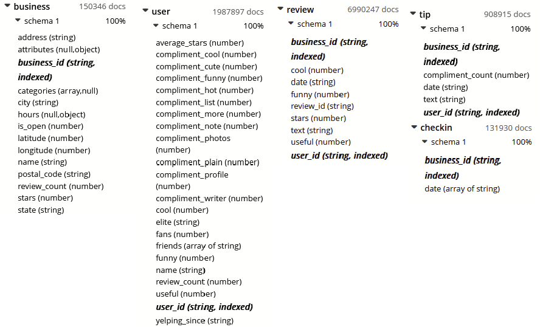

# Configuration Files

To configure the benchmark, you can use configuration files that define the settings for the benchmark. The format of these files is described in detail in this file.

## Common Structure

No matter the type of benchmark, the configuration files have a common structure that includes the following fields:
- **numberOfExecutions**: a number that specifies the number of times of query will be executed in case of a single query benchmark, or the total number of executions for a workload benchmark.
- **selectedDatabase**: The databases that will be used for the benchmark. The values can be COUCHBASE, POSTGRESQL, POSTGRESQL_JSONB.
- **selectedSize**: The size of the dataset to be used for the benchmark. The values can be SMALL, MEDIUM, LARGE.
- **indexes**: Optional field that specifies the indexes to be created for the benchmark.

### Index

Indexes are maps that have the name of the database as the key and an array of objects as the value. The object contains the following fields:
- **table**: a string that specifies the table on which the index will be created.
- **fields**: an array of strings that specifies the fields on which the index will be created.
- **name**: a string that specifies the name of the index.
- **type**: The type of the index. The values can be BTREE, HASH, GIN, SPGIST, BRIN or GIST. If you give a type to a Couchbase index, it will be ignored as Couchbase does not support index types.

Here is an example of the part of the configuration file that defines the common structure:

```json
{
  "numberOfExecutions": 1,
  "selectedDatabases": [
    "COUCHBASE", "POSTGRESQL", "POSTGRESQL_JSONB"
  ],
  "selectedSize": "LARGE",
  "indexes": {
    "POSTGRESQL": [
      {
        "table": "business",
        "fields": ["city"],
        "name": "test2",
        "type": "BTREE"
      }
    ],
    "POSTGRESQL_JSONB": [
      {
        "table": "business",
        "fields": ["city"],
        "name": "test2",
        "type": "BTREE"
      }
    ]
   },...
}
```

## Unique Query Benchmark

Unique queries have an additional field **selectedQuery** that specifies the query to be executed. The possible values are: `FILTER_IS_MISSING`, `FILTER4`, `ARRAY`, `NEST`, `NEST_AGG`, `UNNEST`, `UNNEST_GROUP_BY`, `AGG`, `SELECT`, `FILTER`, `JOIN1`, `JOIN_FILTER`, `CUSTOM`, `IMBRICATION_FILTER`.

The field to add to the configuration file for a unique query is as follows:

```json
{
  "selectedQuery": "FILTER_IS_MISSING"
}
```

## Custom Query Benchmark

Custom queries have an additional field **customQueries** that specifies the custom queries to be executed. The value of this field is a map where the key is the name of the database and the value is the text of the query to be executed.

The field to add to the configuration file for a custom query is as follows:

```json
{
  "customQueries": {
    "COUCHBASE": "SELECT * FROM business WHERE city = 'Lausanne'",
    "POSTGRESQL": "SELECT * FROM business WHERE city = 'Lausanne'",
    "POSTGRESQL_JSONB": "SELECT * FROM business WHERE city = 'Lausanne'"
  }
}
```

To write queries, you can refer to the database schema in the `Database schema` section of this document.

## Workload Benchmark

Workload benchmarks have an additional field **selectedWorkload** that specifies the workload to be executed. The possible values are: `COMPLETE`, `FILTER`, `JOIN`, `IMBRICATION_OPERATIONS`, `DATA_ANALYSIS`.

The field to add to the configuration file for a workload benchmark is as follows:

```json
{
  "selectedWorkload": "FILTER"
}
```

## Custom Workload Benchmark

Custom workloads have an additional field **customWorkloadQueries** that specifies the custom queries to be executed. The value of this field in an array that contains objets where each object has the following fields:
- **type**: The type of the query. The values are listed in the `selectedQuery` field of the unique query benchmark.
- **ratio**: number that specifies the ratio of the query in the workload. The query will be executed `ratio` times `numberOfExecutions`.

The field to add to the configuration file for a custom workload benchmark is as follows:

```json
{
  "customWorkloadQueries": [
    {
      "type": "FILTER",
      "ratio": 0.5
    },
    {
      "type": "JOIN",
      "ratio": 0.5
    }
  ]
}
```

and here is an example of a complete configuration file for a custom workload benchmark with indexes:

```json
{
  "customWorkloadQueries" : [
		{
			"type" : "NEST",
			"ratio" : 0.5
		},
		{
			"type" : "UNNEST",
			"ratio" : 0.5
		}		
	],
	"selectedSize" : "LARGE",
  "numberOfExecutions": 10,
  "selectedDatabases": [
    "POSTGRESQL"
  ],
	"indexes": {
		"POSTGRESQL" : [
			{
				"table" : "business_categories",
				"fields" : ["category"],
				"name" : "idx_business_cat",
				"type" : "BTREE"
			}
		]
	}
}
```

## Database Schema

To write customed queries, you need to know the schema of the databases used in the benchmark. The schema for each database is as follows:

### PostgreSQL



### Couchbase and PostgreSQL JSONB

There isn't exactly a schema for Couchbase and PostgreSQL JSONB, as they are NoSQL databases. However, the global structure of the documents in these databases is as follows:



- You can find all the values that can be taken in the `attributes` field of the `business` collection in the `configuration/attributes.md` file.
- You can find all the values that can be taken in the `categories` field of the `business` collection in the `configuration/categories.md` file.

## Examples Files

You can find examples of configuration files in the `configuration/examples` directory. 

- `unique-query.json`: Example of a configuration file for a predefined unique query benchmark. It should be sent to the endpoint `/benchmark/unique`.
- `custom-query.json`: Example of a configuration file for a custom query benchmark. It should be sent to the endpoint `/benchmark/unique-custom`.
- `complete_workload.json`: Example of a configuration file for a predefined workload benchmark. It should be sent to the endpoint `/benchmark/workload`.
- `workload_custom.json`: Example of a configuration file for a custom workload benchmark. It should be sent to the endpoint `/benchmark/workload-custom`.