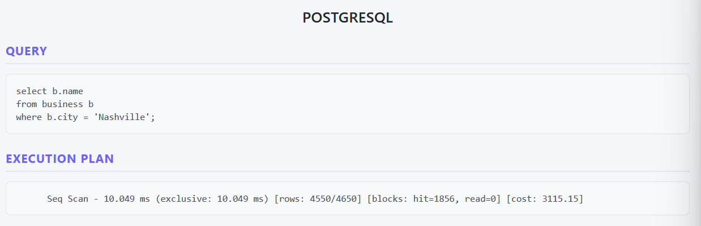

# Frontend

The frontend of the benchmark application is a Vue 3 + Vite project. It provides a user interface for configuring and running benchmarks, as well as viewing the results.

## Prerequisites

Before you begin, ensure you have met the following requirements:

- You have a supported version of Node.js installed (recommended version: v22).
- You have npm (Node Package Manager) installed (recommended version: 11).

## Project Setup

### Install Dependencies

Run the following command to install the necessary dependencies:

```sh
npm install
```

### Compile and Hot-Reload for Development

To start the development server with hot-reloading, run:

```sh
npm run dev
```

### Compile and Minify for Production

To build the project for production, which compiles and minifies the code, run:

```sh
npm run build
```

## Features 

### Select how you want to configure the benchmark

Using the radio buttons at the top, you can choose how to configure your benchmark.


#### Config files

The Config files form allows you to upload a configuration file that contains the benchmark settings. The format of the config files are explicitly defined in the `configuration` folder of the project.


You can choose the following options:
- **Benchmark Type**: Select the type of benchmark you want to run. You can choose between the following types:
  - Unique Query: A single query benchmark with a predefined query.
  - Custom Query: A single query benchmark with a custom query.
  - Workload: A predefined workload benchmark with multiple queries.
  - Custom Workload: A workload benchmark with a custom set of queries.
- **Benchmark Configuration**: Upload a configuration file that contains the benchmark settings, either by dragging and dropping the file or by clicking the "Browse Files" button to select it from your file system.

#### Unique Query

The Unique Query form allows you to configure a single query benchmark with a predefined query.


You can choose the following options:
- **Type of query**: Select the type of query you want to run in the drop down menu.
- **Number of executions**: Specify how many times you want to execute the query.
- **Database**: Select the databases you want to run the query against. You must select at least one database.
- **Database Size**: Choose the size of the database you want to use for the benchmark.

#### Workload

The Workload form allows you to configure a workload benchmark with multiple queries.


You can choose the following options:
- **Type of workload**: Select the type of workload you want to run in the drop down menu.
- **Number of executions**: Specify the total number of executions for the workload.
- **Database**: Select the databases you want to run the workload against. You must select at least one database.
- **Database Size**: Choose the size of the database you want to use for the benchmark.

#### Attention

Once you click on the "Run Benchmark" button, the benchmark will be executed with the selected configuration. This step may take some time depending on the complexity of the benchmark and the size of the databases.

## Results

The results of the benchmark will be displayed here once the execution is complete. You can view various metrics and statistics related to the benchmark, including:

- Statistics related to execution time
- Information about the cache usage
- Details about the queries executed (text and execution plan)
- Information about the indexes of the database

<p align="center">
    
    
</p>

You can also download the results as an HTML file by clicking the "Download Report" button. Once the report is generated, it will be automatically downloaded to your computer. The report contains more information about the benchmark execution, including detailed statistics and graphs.